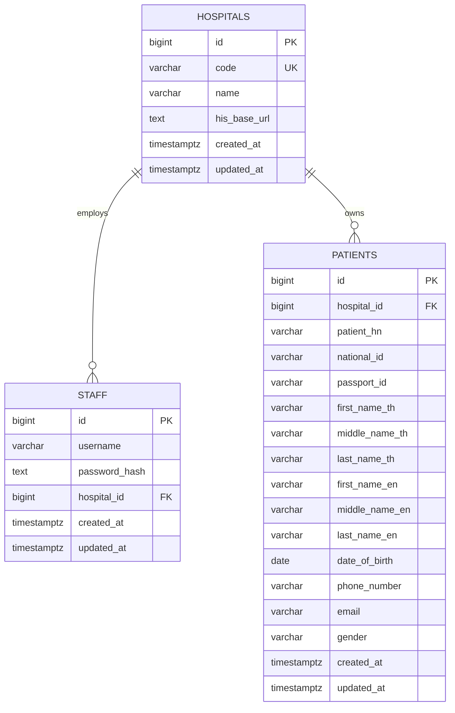

# ER Diagram

## Keys and constraints

- `hospitals.code` is globally unique and lowercase.
- `staff (hospital_id, username)` is unique.
- `patients (hospital_id, patient_hn)` is unique and is the HIS cache upsert key.
- Non-null national and passport IDs are separately unique within a hospital.
- Every patient must have at least one of `national_id` or `passport_id`.
- `gender`, when present, is `M` or `F`.
